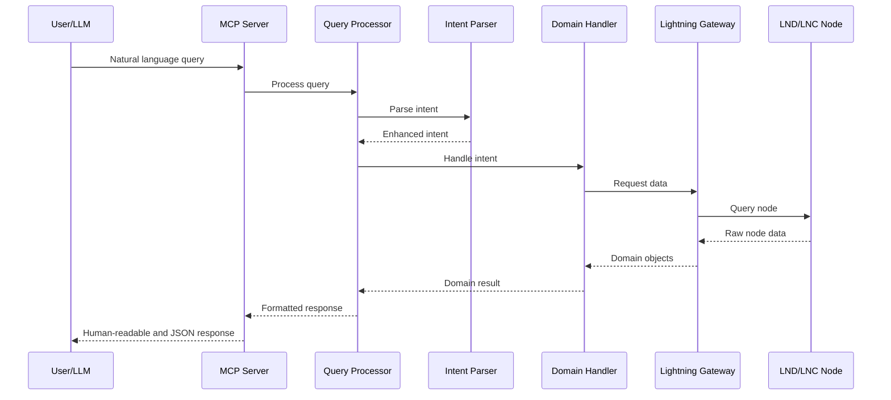

# LND MCP Server Architecture

This document provides a comprehensive architectural overview of the Lightning Network MCP Server. It details the design principles, patterns, and implementations that enable natural language queries to a Lightning Network node.

## 1. Architectural Overview

The Lightning Network MCP Server follows clean architecture principles with a domain-driven design approach. This creates clear separation of concerns, making the codebase maintainable, testable, and adaptable to different Lightning Network implementations.

### Architectural Layers

1. **Domain Layer**: Contains the core business logic, entities, value objects, and gateway interfaces
2. **Infrastructure Layer**: Implements the gateway interfaces for specific technologies (LND, LNC)
3. **Application Layer**: Orchestrates the flow between interfaces and domain logic
4. **Interface Layer**: Handles external communication via the MCP protocol

## 2. Domain Layer

The domain layer is the heart of the application, containing:

### Entities and Value Objects

The domain model represents Lightning Network concepts through:

- **Entities**: Core domain objects with identity and lifecycle
  - `Channel`: Represents a Lightning Network payment channel
- **Value Objects**: Immutable objects representing domain concepts without identity
  - `Balance`: Represents channel balances (local/remote)
  - `Capacity`: Represents channel capacity
  - `HealthCriteria`: Defines thresholds for channel health

Value objects ensure type safety and encapsulate validation and business rules:

```typescript
// Example of a Value Object
export class Balance {
  private readonly value: number;

  private constructor(value: number) {
    this.value = value;
  }

  static create(value: number): Balance {
    if (value < 0) {
      throw new Error('Balance cannot be negative');
    }
    return new Balance(value);
  }

  getValue(): number {
    return this.value;
  }

  ratioOf(capacity: Capacity): number {
    return this.value / capacity.getValue();
  }
}
```

### Domain Handlers

Domain handlers process domain-specific operations:

- `ChannelDomainHandler`: Manages channel-related queries
- `DomainHandler`: Interface for all domain handlers
- `DomainHandlerRegistry`: Maintains and routes to appropriate handlers

The handler pattern centralizes domain logic and separates it from infrastructure concerns.

### Gateway Pattern

The gateway pattern provides a clean abstraction for accessing external systems:

```typescript
// Gateway interface in domain layer
export interface LightningNetworkGateway {
  getChannels(): Promise<ChannelData[]>;
  getNodeInfo(pubkey: string): Promise<NodeInfo | undefined>;
  getNodeAlias(pubkey: string): Promise<string | undefined>;
  getConnection(): LightningNodeConnection;
}
```

This interface is implemented by concrete implementations in the infrastructure layer, allowing the domain layer to remain independent of specific Lightning Network implementations.

### Intent Parsing with Strategy Pattern

The system uses the Strategy pattern for intent parsing:

- `IntentParserStrategy`: Interface for different parsing strategies
- `RegexIntentParser`: Implementation using regular expressions
- `IntentParserFactory`: Creates the appropriate strategy based on configuration

This approach allows for:

- Easy swapping of parsing implementations
- Future enhancement with more sophisticated NLP strategies
- Separation of parsing logic from domain handling

## 3. Infrastructure Layer

The infrastructure layer implements domain interfaces for specific technologies:

### Gateway Implementations

- `LndGateway`: Implementation for direct LND connections
- `LncGateway`: Implementation for Lightning Node Connect

Each gateway:

- Implements the `LightningNetworkGateway` interface
- Translates between domain models and external API data
- Handles specific connection requirements

### Connection Management

- `LightningNodeConnection`: Abstraction for node connections
- `ConnectionAuth`: Handles authentication for different connection types
- `ConnectionFactory`: Creates connections based on configuration

## 4. Application Layer

The application layer orchestrates the flow between interfaces and domain:

- `LightningQueryProcessor`: Processes queries by:
  1. Parsing natural language to intents
  2. Routing to appropriate domain handlers
  3. Formatting responses for external consumption

## 5. Interface Layer

The interface layer handles communication with external systems:

- `McpServer`: Implements the MCP protocol for communication with LLMs
- `LightningMcpController`: Exposes Lightning Network functionality via MCP

## 6. Data Flow



## 7. Key Design Patterns

### Gateway Pattern

The Gateway pattern provides a clean abstraction for external resources, allowing the domain layer to remain free of implementation details.

### Strategy Pattern

The Strategy pattern enables swappable implementations for intent parsing, making it easy to enhance or replace parsing logic.

### Factory Pattern

Factories create appropriate implementations based on configuration:

- `ConnectionFactory`: Creates the right connection type
- `LightningNetworkGatewayFactory`: Creates the corresponding gateway
- `IntentParserFactory`: Creates the appropriate parser

### Value Object Pattern

Value objects encapsulate domain concepts, ensuring validation and providing business methods. They're immutable and don't have identity.

## 8. Type Safety and Validation

The system leverages TypeScript and Zod for robust type safety:

- **Static Types**: TypeScript provides compile-time checking
- **Runtime Validation**: Zod schemas validate input/output data
- **Schema/Type Alignment**: Types are derived from schemas to ensure consistency

```typescript
// Schema definition with Zod
export const ChannelParamsSchema = z.object({
  capacity: z.number().positive(),
  localBalance: z.number().nonnegative(),
  remoteBalance: z.number().nonnegative(),
  active: z.boolean(),
  remotePubkey: z.string(),
  channelPoint: z.string(),
  remoteAlias: z.string().optional(),
});

// Type derived from schema
export type ChannelParams = z.infer<typeof ChannelParamsSchema>;
```

## 9. Project Structure

The project structure mirrors the architectural layers:

```
src/
├── domain/            # Domain layer
│   ├── channels/      # Channel domain
│   │   ├── entities/  # Channel entities
│   │   ├── schemas/   # Schema definitions
│   │   └── value-objects/  # Domain value objects
│   ├── handlers/      # Domain operation handlers
│   ├── intents/       # Intent parsing
│   │   ├── entities/  # Intent models
│   │   ├── factories/ # Parser factories
│   │   └── strategies/  # Parsing strategies
│   ├── lightning/     # Lightning domain
│   │   └── gateways/  # Gateway interfaces
│   └── node/          # Node domain
├── infrastructure/    # Infrastructure layer
│   ├── factories/     # Infrastructure factories
│   ├── lnd/           # LND implementation
│   └── lnc/           # LNC implementation
├── application/       # Application layer
│   └── processors/    # Query processors
├── interfaces/        # Interface layer
│   └── mcp/           # MCP protocol implementation
└── core/              # Cross-cutting concerns
    ├── config/        # Configuration management
    ├── errors/        # Error handling
    ├── logging/       # Logging utilities
    └── validation/    # Validation utilities
```

## 10. Future Extensibility

The architecture supports several extension points:

1. **New Lightning Implementations**: Add new gateway implementations in the infrastructure layer
2. **Enhanced NLP**: Replace the RegexIntentParser with more sophisticated NLP
3. **Additional Domain Data**: Expand beyond channels to payments, invoices, etc.
4. **Advanced Health Metrics**: Enhance health criteria and analysis capabilities

## Conclusion

The Lightning Network MCP Server architecture demonstrates how clean architecture and domain-driven design principles create a system that is:

- **Modular**: Components can be developed and tested independently
- **Extensible**: New functionality can be added without disrupting existing code
- **Maintainable**: Clear separation of concerns simplifies understanding and changes
- **Adaptable**: Multiple Lightning Network implementations are supported through abstractions

This architecture ensures the system can grow and adapt to changing requirements while maintaining a strong foundation of domain concepts and clean separation of concerns.
