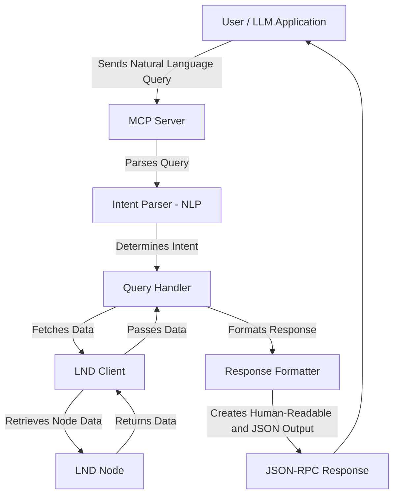

# LND MCP Server Architecture

This document provides a comprehensive architectural overview of the LND MCP Server—a clean, well-structured server that connects to an LND node and enables users to query node information using natural language. It serves both as a technical reference for developers and as an onboarding tool for new contributors.

---

## 1. High-Level Architectural Overview

The LND MCP Server is designed to bridge the gap between complex LND node data and user-friendly, natural language queries. The core workflow can be summarized as follows:

1. **Input:** A user (or LLM application) sends a natural language query.
2. **NLP Processing:** The server parses the query to determine user intent.
3. **Data Fetching:** Based on the identified intent, the server retrieves relevant channel or node data from the connected LND node.
4. **Response Formatting:** The data is formatted into both human-readable text and structured JSON.
5. **Output:** The response is returned via a JSON-RPC interface over standard input/output.

Below is a Mermaid diagram illustrating the high-level data flow:

---

## 2. Technology Stack

The LND MCP Server leverages a modern technology stack to ensure a clean and maintainable codebase while securely interfacing with LND nodes and processing natural language queries efficiently.

### Key Components

- **Node.js & TypeScript:** The server is built with Node.js and TypeScript, ensuring type safety, maintainability, and modern JavaScript features.
- **LND Integration (ln-service):** Uses the `ln-service` library to establish secure connections with LND nodes, utilizing TLS certificates and macaroons.
- **Natural Language Processing:** A custom NLP module (located in `src/mcp/nlp/intentParser.ts`) parses user queries to identify intent types (e.g., channel list, channel health, channel liquidity).
- **JSON-RPC Communication:** The server communicates using JSON-RPC over standard input/output, providing a flexible interface for LLM applications.
- **Logging and Error Handling:** Utilizes structured logging (e.g., Pino) and robust error handling mechanisms to ensure reliability and security.
- **Testing Frameworks:** Extensive unit and integration tests (using Jest) ensure that each module functions correctly in isolation and in the full data flow.

---

## 3. Design Decisions

### Scalability

- **Modular Architecture:** The separation of concerns (LND integration, NLP, query handling, and response formatting) allows each component to scale independently. New features or query types can be added with minimal impact on existing code.
- **Asynchronous Processing:** Leveraging async/await and Promise-based patterns ensures non-blocking I/O, which is critical for handling multiple concurrent queries from service providers.

### Security

- **Secure LND Connections:** The use of TLS certificates and read-only macaroons ensures that communication with the LND node is secure and that only authorized queries are processed.
- **Input Sanitization and Error Handling:** The server sanitizes incoming queries and logs errors without exposing sensitive information, thus maintaining security while troubleshooting.

### Maintainability

- **Clean Code Practices:** The project adheres to Clean Code principles by using meaningful variable names, small focused functions, and extensive unit testing.
- **TypeScript:** Type definitions across modules help maintain consistency and catch potential bugs at compile time.

---

## 4. Codebase Structure Mapping

The repository is organized to clearly separate each functional area:

- **Configuration:**
  - `src/config/` contains modules for loading and validating environment variables.
- **LND Integration:**

  - `src/lnd/client.ts` establishes and maintains the connection to the LND node.
  - `src/lnd/queries.ts` implements functions to query the LND node for channel and node information.

- **Natural Language Processing:**

  - `src/mcp/nlp/intentParser.ts` parses natural language queries and maps them to predefined intents.

- **Query Handling:**

  - `src/mcp/handlers/channelQueryHandler.ts` processes queries related to channel data by interfacing with the LND client.
  - `src/mcp/tools/channelQueryTool.ts` integrates NLP and query handling into an end-to-end tool.

- **Utilities:**

  - `src/utils/` includes logging, sanitization, and other helper functions.

- **Type Definitions:**

  - `src/types/` defines interfaces and types that maintain consistency across modules.

- **Testing:**
  - `src/__tests__/` contains unit and integration tests ensuring each component functions as intended.

---

## 5. Translating Natural Language to LND Commands

The system translates natural language queries into LND node commands through the following process:

1. **Query Reception:** A user query is received via JSON-RPC.
2. **Intent Parsing:** The `IntentParser` module analyzes the text to determine whether the query is about listing channels, checking channel health, or analyzing liquidity.
3. **Command Mapping:** Based on the identified intent, the appropriate query handler is invoked. For example, a channel list query triggers the channel query handler, which in turn calls functions in `ln-service` to fetch data.
4. **Response Generation:** The results are processed and formatted into a dual response—human-readable text for easy consumption and structured JSON for programmatic use.

---

## 6. Error Handling, Security, and Testing

### Error Handling

- **Structured Logging:** All errors and warnings are logged with sufficient context for debugging.
- **Graceful Degradation:** When errors occur (e.g., invalid queries or connection issues), the server sends standardized JSON-RPC error responses.
- **Input Sanitization:** The system sanitizes input data to prevent injection attacks or unintended behavior.

### Security Measures

- **Authentication:** Uses TLS certificates and macaroons to authenticate with the LND node.
- **Environment Isolation:** Different environment configurations (development, test, production) allow for secure and isolated testing and deployment.
- **Error Obfuscation:** Error messages are sanitized to avoid leaking sensitive details.

### Testing Approaches

- **Unit Tests:** Focus on individual modules (e.g., intent parsing, LND queries) to ensure they perform as expected.
- **Integration Tests:** Validate the complete query flow from natural language input to LND data retrieval and response formatting.
- **Mock LND Mode:** The server can run in a mock mode to simulate LND responses, which is useful for development and automated testing.

---

## 7. Future Development Considerations

### Enhancing Natural Language Capabilities

- **Advanced NLP Models:** Incorporate more sophisticated NLP techniques or leverage pre-trained language models to handle a wider variety of queries.
- **Intent Expansion:** Add support for additional query types, such as node statistics, payment history, and network graph analysis.

### Expanding Lightning Network Integrations

- **Multi-Aspect Data Queries:** Extend beyond channel data to include comprehensive node information, transaction histories, and real-time network analytics.
- **Improved Error Diagnostics:** Develop more detailed diagnostic tools and dashboards for operational insights and troubleshooting.

---

## Conclusion

The LND MCP Server is built with scalability, security, and maintainability in mind. Its clean architecture—backed by robust LND integration and efficient natural language processing—ensures that it meets the current needs of lightning network service providers while also providing a strong foundation for future expansion. This architecture document serves as both a technical guide and an onboarding resource, ensuring that contributors can quickly understand and build upon the system.

Happy hacking!
